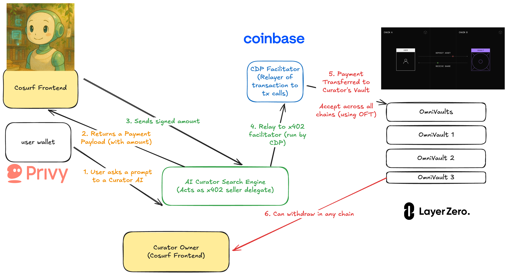

# Cosurf - The End of Information Overload

A revolutionary curation platform that transforms how people discover and interact with information online. By connecting users with expert human curators through AI-powered routing, Cosurf eliminates the noise and surfaces exactly what matters to you.


## 🌊 The Problem We Solve

**The web is fractured across platforms with misaligned incentives.** Current platforms are designed to maximize engagement through endless scrolling and notifications, creating walled gardens that prioritize keeping users on-site for ad revenue rather than helping them find valuable information efficiently.

**There's no unified curation layer that respects user attention.** Without effective curation tools, users can't easily filter the signal from the noise or interact meaningfully with content across platforms. The inability to ask questions of content or receive personalized recommendations based on actual interests creates frustration and inefficiency in knowledge discovery.

## 🎯 Our Solution

Cosurf addresses these problems by creating a **user-centric curation layer that works across platforms**. By combining subscription-based incentives with AI-powered curation, we enable users to focus on high-quality content that truly matters to them. Our curator networks transform fractured browsing experiences into cohesive knowledge journeys, restoring context and giving users control over their attention.

## 🏗️ Architecture

### Core Components

```
┌─────────────────┐    ┌──────────────────┐    ┌─────────────────┐
│   Cosurf Web    │────│  Curator Router  │────│   OmniVaults    │
│   Frontend      │    │     Engine       │    │ (Multi-chain)   │
│   (Next.js)     │    │  (AI-Powered)    │    │                 │
└─────────────────┘    └──────────────────┘    └─────────────────┘
         │                       │                       │
         │              ┌────────▼────────┐             │
         │              │  CDP Facilitator │             │
         │              │ (x402 Payments)  │             │
         │              └─────────────────┘             │
         │                       │                       │
         └───────────────────────┼───────────────────────┘
                                 │
                    ┌────────────▼────────────┐
                    │      LayerZero OFT      │
                    │   (Cross-chain Value)   │
                    └─────────────────────────┘
```



### Curation Flow

1. **User Query**: User asks a question or seeks content recommendations
2. **Curator Matching**: Router Engine analyzes query and matches with relevant curators
3. **Content Discovery**: System surfaces curated content from matched experts
4. **Interactive Q&A**: Users can ask follow-up questions about curated content
5. **Value Exchange**: Users support quality curators through x402 micropayments
6. **Cross-chain Rewards**: Curator earnings flow to OmniVaults on any supported chain
7. **Continuous Learning**: System learns from interactions to improve future matching

## 🛠️ Technology Stack

### Frontend (`web-app-v1/`)
- **Framework**: Next.js 14 with TypeScript
- **Authentication**: Privy (embedded wallets)
- **Styling**: Tailwind CSS
- **State Management**: React hooks + context
- **Wallet Integration**: Privy embedded wallet system

### Backend Services
- **Curator Router Engine**: AI-powered system for matching users with relevant curators
- **x402 Protocol**: Seamless micropayment system for content access
- **CDP Facilitator**: Cross-chain payment infrastructure via Coinbase
- **Personalized Feed**: Intelligent content delivery respecting user attention
- **Dashboard Analytics**: Enterprise monitoring and intelligence system

### Blockchain Infrastructure (`facilitator/`)
- **OmniVaults**: ERC-4626 vaults enabling cross-chain curator earnings
- **Value Exchange**: Fair payment ecosystem prioritizing quality over quantity
- **Universal Payments**: CDP x402 protocol for seamless cross-chain transactions
- **Privacy-First**: Encrypted, verifiable content secured by LayerZero technology
- **Easy Access**: Multiple authentication methods via Privy (email, social, wallet)

## 🚀 Quick Start

### Prerequisites
- Node.js 18+
- pnpm or npm
- Git with submodules

### Installation

```bash
# Clone with submodules
git clone --recursive https://github.com/your-org/cosurf.git
cd cosurf

# Install frontend dependencies
cd web-app-v1
npm install

# Install facilitator dependencies
cd ../facilitator/ovault/ovault-evm
npm install
```

### Environment Setup

Create `.env.local` in `web-app-v1/`:

```env
# Privy Configuration
NEXT_PUBLIC_PRIVY_APP_ID=your_privy_app_id
PRIVY_APP_SECRET=your_privy_app_secret

# Cosurf Configuration
NEXT_PUBLIC_X402_FACILITATOR_URL=http://localhost:3002
NEXT_PUBLIC_CURATOR_ENGINE_URL=http://localhost:3001

# Coinbase CDP
CDP_API_KEY_NAME=your_cdp_key_name
CDP_PRIVATE_KEY=your_cdp_private_key
```

### Development

```bash
# Start frontend (Next.js)
cd web-app-v1
npm run dev

# Start facilitator service (separate terminal)
cd facilitator/ovault/ovault-evm
npm run dev

# Deploy contracts (testnet)
npm run deploy:sepolia
```

## ✨ Core Features

### 1. Curator Router Engine
A sophisticated system that connects users with the most relevant curators based on their interests and information needs. This engine analyzes content preferences and browsing patterns to match users with curators who excel in specific domains, solving the problem of fractured web experiences by creating personalized pathways to high-quality content across platforms.

### 2. Personalized Feed and Notifications
An intelligent content delivery system that provides users with curated information tailored to their specific interests and needs. Unlike platform-centric feeds designed to maximize engagement, our personalized feed respects user attention by surfacing only the most valuable and relevant content, with notifications that inform rather than distract.

### 3. Dashboard (Business Plan)
A comprehensive monitoring solution that aggregates and analyzes the most updated information across any topic or industry. This enterprise-focused dashboard enables teams to maintain awareness of critical developments without constant manual research, transforming fragmented content discovery into a streamlined intelligence system.

## 🎬 Use Cases

### Content Discovery
**"Find exactly what you need through human expertise"**

A movie buff uses Cosurf to find people with similar taste in films. The Curator Router Engine connects them with other cinephiles who share their preference for indie horror films or classic foreign cinema. When browsing for weekend movie options, they don't waste time scrolling through generic "top 10" lists—instead, they see suggestions from curators whose taste they trust. They can even ask questions like "What would Warren Buffett recommend for my first investment?" and get responses based on curated content from investment experts.

### Investment Intelligence
**"Transform passive consumption into active knowledge acquisition"**

An investment analyst subscribes to financial curators through Cosurf to monitor market movements across multiple sectors. Unlike traditional financial news platforms that focus on engagement metrics, Cosurf's Router Engine intelligently matches the analyst with curators who have proven track records in specific industries. The personalized feed delivers time-sensitive information prioritized by relevance rather than recency, ensuring the analyst never misses critical market signals.

### Educational Communities
**"Living knowledge ecosystems that grow more valuable with participation"**

A group of machine learning researchers creates a specialized curator network focused on AI advancements. Community members contribute high-quality resources—from academic papers to practical tutorials—that are vetted by domain experts rather than algorithmic recommendations. When users have questions about specific ML techniques, they can interact directly with curated content, asking questions that draw connections between multiple resources.

## 💰 Payment & Value Exchange

### How It Works

Cosurf implements a fair payment ecosystem where creators get paid for quality, not quantity. Using CDP's x402 protocol, our cross-chain solution handles payments seamlessly—send payment from any blockchain and we take care of the technical details invisibly.

#### Example: Content Access Flow
```http
GET /curated/content?topic=sustainable+investing HTTP/1.1
Host: api.cosurf.com

HTTP/1.1 402 Payment Required
Content-Type: application/json

{
  "x402Version": 1,
  "error": "X-PAYMENT header is required",
  "accepts": [{
    "scheme": "exact",
    "network": "base-sepolia",
    "maxAmountRequired": "50000",  // $0.05 USDC
    "resource": "/curated/content",
    "description": "Expert-curated sustainable investing insights",
    "mimeType": "application/json",
    "payTo": "0x742d35Cc64C3E3b24a3A4c1537e2b68b5e04e7A2",
    "maxTimeoutSeconds": 60,
    "asset": "0x036CbD53842c5426634e7929541eC2318f3dCF7e"
  }]
}
```

#### Value Delivered
```http
GET /curated/content?topic=sustainable+investing HTTP/1.1
X-PAYMENT: eyJ4NDAyVmVyc2lvbiI6MSwic2NoZW1lIjoiZXhhY3QiLCJuZXR3b3JrIjoi...

HTTP/1.1 200 OK
X-PAYMENT-RESPONSE: eyJzdWNjZXNzIjp0cnVlLCJ0cmFuc2FjdGlvbiI6IjB4YWJjZGVmMTIzNCIsIm5ldHdvcmsiOiJiYXNlLXNlcG9saWEifQ==

{
  "curatedContent": [...],
  "expertInsights": [...],
  "interactiveQ&A": true,
  "curatorCredentials": [...]
}
```

### Payment Security

- **EIP-3009 Signatures**: Gasless USDC transfers with typed data signing
- **Temporal Validation**: Time-bound authorizations prevent replay attacks
- **Balance Verification**: Pre-flight balance checks ensure payment viability
- **Non-custodial**: Facilitator never holds user funds
- **Multi-network**: Support for Base, Avalanche, IoTeX networks

## 🏦 Curator Economy

### How Curators Earn

Cosurf creates sustainable income streams for quality content creators:

- **Quality-Based Rewards**: Earn based on user satisfaction and engagement quality, not quantity
- **Subscription Revenue**: Regular income from users who value your expertise
- **Cross-chain Flexibility**: Receive payments on any supported blockchain network
- **Transparent Analytics**: Clear metrics showing your impact and earnings

### OmniVault Technology

```solidity
// Curators deploy personalized cross-chain vaults
contract CuratorERC4626 is ERC4626, OFT {
    // ERC-4626 yield-bearing vault functionality
    // LayerZero OFT for cross-chain transfers
    // Automated revenue distribution and compounding
}
```

### Cross-chain Benefits

- **Universal Access**: Receive payments from any supported blockchain
- **Instant Settlement**: Automated payment processing via CDP facilitator
- **Yield Generation**: Automatic compounding of curator earnings
- **Global Reach**: Serve users regardless of their preferred blockchain network

### Supported Networks

| Network | Chain ID | USDC Contract | Status |
|---------|----------|---------------|--------|
| Base Sepolia | 84532 | `0x84186489065d54EBe700C89B0672666eC6E4a932` | ✅ Active |
| Arbitrum Sepolia | 421614 | `0xB576DB4f18687e9b995D8f691CACe0330B1c6cbf` | ✅ Active |
| Optimism Sepolia | 11155420 | `0x3bCf26217F5E739F35af7436Ddf213554b95BD3f` | ✅ Active |

## 🔍 API Reference

### Content Discovery API

```typescript
// Get curated content by topic
POST /api/v1/content/discover
{
  "query": "sustainable investing strategies",
  "preferences": {
    "expertise_level": "intermediate",
    "content_types": ["articles", "analysis", "videos"],
    "curator_filters": ["finance_experts", "sustainability_focus"]
  }
}

// Response (after x402 payment)
{
  "curatedContent": CuratedContent[],
  "matchedCurators": CuratorProfile[],
  "interactiveElements": {
    "qna_enabled": true,
    "follow_up_questions": string[]
  },
  "relevanceScore": 0.92
}
```

### Curator API

```typescript
// Register as curator
POST /api/v1/curators/register
{
  "name": "Sustainable Finance Expert",
  "description": "15+ years in ESG investing and green finance",
  "specialties": ["ESG", "Green Bonds", "Impact Investing"],
  "credentials": ["CFA", "Certified ESG Analyst"],
  "vaultAddress": "0x...",
  "content_focus": ["research", "market_analysis"]
}

// Curator performance metrics
GET /api/v1/curators/{id}/metrics
{
  "earnings": {
    "total": "2450.75",
    "monthly": "185.20",
    "currency": "USDC"
  },
  "engagement": {
    "users_served": 1247,
    "satisfaction_score": 4.7,
    "repeat_users": 0.68
  },
  "content_impact": {
    "questions_answered": 342,
    "recommendations_made": 156,
    "follow_ups_generated": 89
  }
}
```

### Payment API

```typescript
// Verify payment capability
POST /api/x402/verify
{
  "paymentPayload": PaymentPayload,
  "paymentRequirements": PaymentRequirements
}

// Settle payment
POST /api/x402/settle
{
  "paymentPayload": PaymentPayload,
  "paymentRequirements": PaymentRequirements
}
```

## 🧪 Testing

### Unit Tests
```bash
# Frontend tests
cd web-app-v1
npm run test

# Smart contract tests
cd facilitator/ovault/ovault-evm
forge test
```

### Integration Tests
```bash
# Full payment flow test
npm run test:integration

# Cross-chain vault test
npm run test:omnichain
```

### Load Testing
```bash
# x402 payment performance
npm run test:load:payments

# Search API performance
npm run test:load:search
```

## 📈 Monitoring & Analytics

### Key Metrics Tracked

- **Content Quality**: User satisfaction scores and curator performance
- **Curation Effectiveness**: Relevance scores and engagement metrics
- **Value Exchange**: Fair compensation distribution to curators
- **Network Health**: Cross-chain transaction success rates
- **User Experience**: Time-to-value and attention respect metrics
- **Knowledge Discovery**: Question-answer success rates and learning outcomes

### Monitoring Stack

- **Application**: Next.js built-in analytics
- **Blockchain**: Custom event indexing via viem
- **Performance**: Vercel analytics and monitoring
- **Errors**: Integrated error tracking and alerting

## 🛡️ Security

### Smart Contract Security

- **Audited Contracts**: ERC-4626 and LayerZero OFT implementations
- **Formal Verification**: Critical payment logic mathematically proven
- **Multi-sig Controls**: Admin functions require multiple signatures
- **Upgrade Patterns**: Transparent proxy patterns for safe upgrades

### API Security

- **Rate Limiting**: Per-user and per-IP request limits
- **Input Validation**: Comprehensive schema validation
- **Authentication**: Privy-based wallet authentication
- **CORS**: Proper cross-origin resource sharing policies

## 🤝 Contributing

### Development Workflow

1. **Fork & Clone**: Create your own fork of the repository
2. **Feature Branch**: `git checkout -b feature/your-feature-name`
3. **Development**: Make changes with comprehensive tests
4. **Testing**: Ensure all tests pass and coverage is maintained
5. **Pull Request**: Submit PR with detailed description

### Code Standards

- **TypeScript**: Strict mode enabled, full type coverage
- **Linting**: ESLint + Prettier for consistent formatting
- **Testing**: Jest for unit tests, Playwright for E2E
- **Documentation**: Comprehensive JSDoc for all public APIs

### Contribution Areas

- 🔍 **Search Enhancement**: Improve AI curation algorithms
- 💰 **Payment Optimization**: Enhance x402 protocol efficiency
- 🌐 **Network Expansion**: Add support for new blockchain networks
- 🎨 **UI/UX**: Frontend improvements and accessibility
- 📊 **Analytics**: Enhanced metrics and reporting features

## 📋 Roadmap

### Phase 1: Foundation (Current)
- [x] Curator Router Engine core functionality
- [x] x402 micropayment integration
- [x] Multi-auth system (Privy integration)
- [x] OmniVault cross-chain infrastructure
- [ ] Interactive Q&A system
- [ ] Basic curator onboarding

### Phase 2: Enhanced Curation (Q2 2024)
- [ ] Advanced curator matching algorithms
- [ ] Personalized feed optimization
- [ ] Curator reputation and credentialing system
- [ ] Mobile app with offline content access
- [ ] Additional network support (Arbitrum, Optimism)

### Phase 3: Ecosystem Growth (Q3 2024)
- [ ] Enterprise dashboard for business users
- [ ] Third-party curator API marketplace
- [ ] Community-driven content validation
- [ ] Advanced analytics and insights
- [ ] Creator monetization tools

### Phase 4: Scale & Optimize (Q4 2024)
- [ ] AI-powered content recommendation enhancement
- [ ] Global content delivery optimization
- [ ] Institutional features and compliance
- [ ] Cross-platform integration (browser extensions, mobile widgets)

## 📄 License

This project is licensed under the MIT License - see the [LICENSE](LICENSE) file for details.

## 🆘 Support

### Community

- **Discord**: [Join our community](https://discord.gg/cosurf)
- **Twitter**: [@CosurfApp](https://twitter.com/cosurfapp)
- **Telegram**: [Developer Chat](https://t.me/cosurfdev)

### Technical Support

- **Documentation**: [Full docs](https://docs.cosurf.com)
- **API Reference**: [OpenAPI spec](https://api.cosurf.com/docs)
- **Issues**: [GitHub Issues](https://github.com/your-org/cosurf/issues)

### Contact

- **Email**: developers@cosurf.com
- **Security**: security@cosurf.com
- **Business**: partnerships@cosurf.com

---

**Cosurf: The end of information overload.**

Built with ❤️ by the Cosurf team • Powered by x402, LayerZero, and Coinbase CDP

*"Find exactly what you need through human-curated content that respects your time and attention."*
